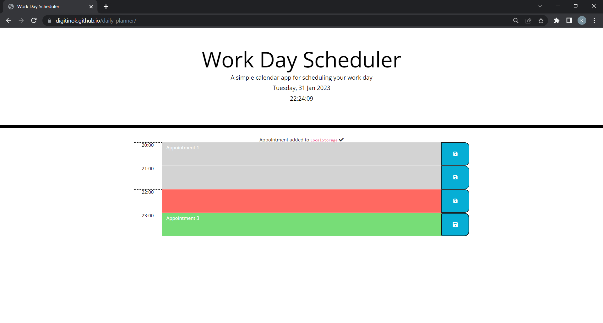

# Daily Planner App

A simple calendar application that allows a user to save events for each hour of the day by modifying

## Description

This is a simple app to plan your day, hour by hour.  All your appointments will be stored.  The current hour will be highlighted in red, while futures ones will be green.

### Repository

https://github.com/digitinok/daily-planner

### Deployed Page

https://digitinok.github.io/daily-planner/

## Installation

n/a - This app just runs in the browser.

## Usage

To use the "Work Day Scheduler" just click into the grey / red or green calendar fields and add your appointments.  They'll be stored when you press the save button for the corresponding time line.  Have fun scheduling your day!

This is how the deployed page looks like:

Screenshot of deployed Page

## Future Improvements

The project could be improved adding a button to clear all the current appointments out.  Furthermore could the app automatically clear all appointsments from the previous day to allow you a fresh start.

## Credits

N/A

## License

This project uses the MIT License. Please see the license file in the repositiry for fursther details.